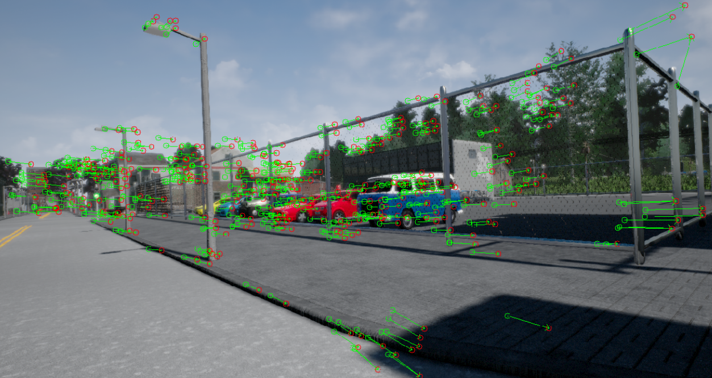
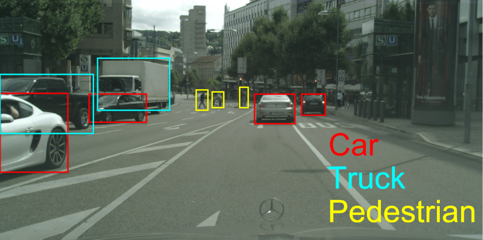
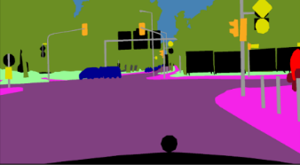

Visual Perception for Self Driving Cars
---
This course is part of the Self-Driving Cars Specialization offered by the University of Toronto on Coursera.

**Description of course:**

This course will introduce you to the main perception tasks in autonomous driving. You'll apply computer vision methods to visual odometry, object detection and tracking, and semantic segmentation. These techniques represent the main building blocks of the perception system for self-driving cars. 

  
